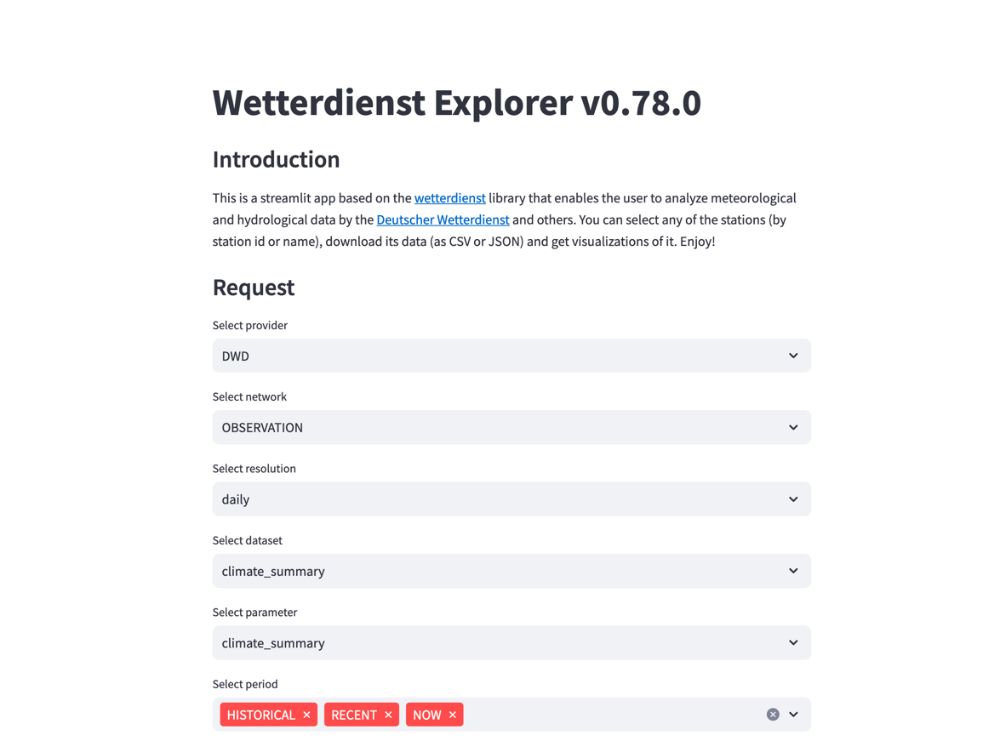

# Explorer 

Navigator for wetterdienst provided open data.


## Introduction

Welcome to Wetterdienst Explorer, your friendly web-based GUI for the Wetterdienst library for Python. This web UI can
easily be self-hosted. A hosted version is available [here](https://wetterdienst.streamlit.app).

## Screenshot



## Features

### Coverage

Wetterdienst Explorer currently covers access to the entire Wetterdienst API. High resolution data may be slow to load.

## Usage

### Invoke service

Install Wetterdienst and invoke the user interface:

```bash
# Install Wetterdienst with Explorer extension
pip install --user wetterdienst[explorer]

# Run Wetterdienst Explorer UI
wetterdienst explorer

# Navigate to web UI
open http://localhost:8501
```

### Invoke using Docker

Run the Wetterdienst user interface using Docker::

```bash
docker run -it --rm --publish=7891:7891 ghcr.io/earthobservations/wetterdienst wetterdienst explorer --listen 0.0.0.0:8501
```
