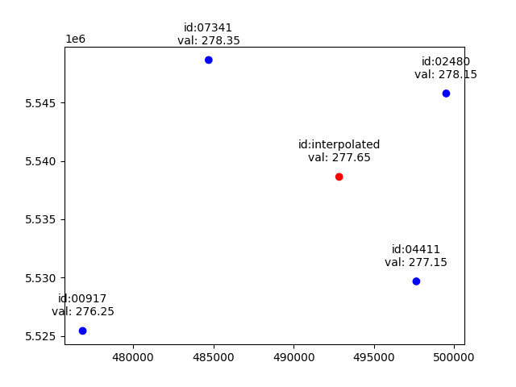
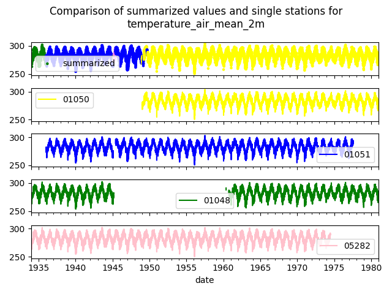

# Interpolation & Summary

Weather stations rarely sit exactly where you need data. Wetterdienst offers two ways to
derive a time series for an arbitrary location from the surrounding station network:

- **Interpolation** — estimate values *at your exact coordinates* by combining the nearest
  stations with a spatial interpolation method. Use this when you want a physically
  plausible value for a point with no station.
- **Summary** — stitch together the *single closest available* station value at each
  timestamp, walking outwards through nearby stations to fill gaps. Use this when you want
  the most complete real-measurement series near a location, rather than a computed blend.

Both features currently work with `DwdObservationRequest` and require the `interpolation`
extra (`scipy`, `shapely`, `utm`):

```bash
pip install "wetterdienst[interpolation]"
```

## Interpolation

The interpolation feature leverages the four closest stations to your specified latitude
and longitude and employs the bilinear interpolation method provided by the scipy package
to interpolate the given parameter values.

The graphic below shows values of the parameter ``temperature_air_mean_2m`` from multiple
stations measured at the same time. The blue points represent the position of a station and
include the measured value. The red point represents the position of the interpolation and
includes the interpolated value.



Values represented as a table:

| station_id | resolution | dataset         | parameter               | date                      | value  |
|------------|------------|-----------------|-------------------------|---------------------------|--------|
| 02480      | daily      | climate_summary | temperature_air_mean_2m | 2022-01-02 00:00:00+00:00 | 278.15 |
| 04411      | daily      | climate_summary | temperature_air_mean_2m | 2022-01-02 00:00:00+00:00 | 277.15 |
| 07341      | daily      | climate_summary | temperature_air_mean_2m | 2022-01-02 00:00:00+00:00 | 278.35 |
| 00917      | daily      | climate_summary | temperature_air_mean_2m | 2022-01-02 00:00:00+00:00 | 276.25 |

The interpolated value looks like this:

| resolution | dataset         | parameter               | date                      | value  |
|------------|-----------------|-------------------------|---------------------------|--------|
| daily      | climate_summary | temperature_air_mean_2m | 2022-01-02 00:00:00+00:00 | 277.65 |

Pass your target coordinates as `latlon` to `.interpolate()`:

```{code-cell}
---
mystnb:
  number_source_lines: true
---
import datetime as dt
from wetterdienst.provider.dwd.observation import DwdObservationRequest

request = DwdObservationRequest(
    parameters=("hourly", "temperature_air", "temperature_air_mean_2m"),
    start_date=dt.datetime(2022, 1, 1),
    end_date=dt.datetime(2022, 1, 20),
)
values = request.interpolate(latlon=(50.0, 8.9))
df = values.df
df
```

Instead of a latlon you may alternatively use an existing station id for which to
interpolate values in a manner of getting a more complete dataset:

```{code-cell}
---
mystnb:
  number_source_lines: true
---
import datetime as dt
from wetterdienst.provider.dwd.observation import DwdObservationRequest

request = DwdObservationRequest(
    parameters=("hourly", "temperature_air", "temperature_air_mean_2m"),
    start_date=dt.datetime(2022, 1, 1),
    end_date=dt.datetime(2022, 1, 20),
)
values = request.interpolate_by_station_id(station_id="02480")
df = values.df
df
```

### Supported parameters

Interpolation is only meaningful for parameters whose fields vary smoothly in space. Two
default search radii apply depending on how strongly a parameter is spatially correlated:

**Large spatial correlation (~40 km default search radius)** — homogeneous fields that vary
slowly across regions: air, soil, dew-point, wet-bulb and surface temperatures, humidity,
wind speed/gust, snow depth (accumulated), sunshine and radiation, air pressure, cloud
cover and evapotranspiration/evaporation.

**Short spatial correlation (~20 km default search radius)** — heterogeneous fields that
vary more locally: precipitation (all variants) and new-snow-per-period parameters.

### Settings

Several settings control the interpolation behaviour (see also the
[settings](settings.md) chapter):

| Name                               | Type             | Default                                                       | Description                                                                                                                     |
|------------------------------------|------------------|--------------------------------------------------------------|-------------------------------------------------------------------------------------------------------------------------------|
| ts_geo_station_distance            | dict[str, float] | 20.0 (precipitation and new-snow variants)<br/>40.0 (other)  | Max distance for stations used for interpolation (in km).                                                                       |
| ts_geo_use_nearby_station_distance | float            | 1.0                                                          | Distance (in km) up to which a nearby station's value is used directly instead of interpolating.                               |
| ts_geo_min_gain_of_value_pairs     | float            | 0.1                                                          | Minimum gain of value pairs for an additional station to be included, to avoid using every station in a dense network.         |
| ts_geo_num_additional_stations     | int              | 3                                                            | Number of additional stations used regardless of the gain, to guarantee a minimum number of stations.                          |

For example, to increase the maximum distance for precipitation interpolation:

```{code-cell}
---
mystnb:
  number_source_lines: true
---
import datetime as dt
from wetterdienst import Settings
from wetterdienst.provider.dwd.observation import DwdObservationRequest

settings = Settings(ts_geo_station_distance={"precipitation_height": 25.0})
request = DwdObservationRequest(
    parameters=("hourly", "precipitation", "precipitation_height"),
    start_date=dt.datetime(2022, 1, 1),
    end_date=dt.datetime(2022, 1, 20),
    settings=settings,
)
values = request.interpolate(latlon=(52.8, 12.9))
df = values.df
df
```

Interpolation is still in its early stages, we welcome feedback to enhance and refine its
functionality.

## Summary

Similar to interpolation you may sometimes want to combine multiple stations to get a
complete list of data. For that reason you can use `.summarize(latlon)`, which walks
through the nearest stations and combines their data meaningfully. The figure below shows
the summarized values of the parameter ``temperature_air_mean_2m`` from multiple stations.



It currently only works for ``DwdObservationRequest`` and individual parameters. Currently
the following parameters are supported (more will be added if useful):
``temperature_air_mean_2m``, ``wind_speed``, ``precipitation_height``.

```{code-cell}
---
mystnb:
  number_source_lines: true
---
import datetime as dt
from wetterdienst.provider.dwd.observation import DwdObservationRequest

request = DwdObservationRequest(
    parameters=("hourly", "temperature_air", "temperature_air_mean_2m"),
    start_date=dt.datetime(2022, 1, 1),
    end_date=dt.datetime(2022, 1, 20),
)
values = request.summarize(latlon=(50.0, 8.9))
df = values.df
df
```

Instead of a latlon you may alternatively use an existing station id for which to summarize
values in a manner of getting a more complete dataset:

```{code-cell}
---
mystnb:
  number_source_lines: true
---
import datetime as dt
from wetterdienst.provider.dwd.observation import DwdObservationRequest

request = DwdObservationRequest(
    parameters=("hourly", "temperature_air", "temperature_air_mean_2m"),
    start_date=dt.datetime(2022, 1, 1),
    end_date=dt.datetime(2022, 1, 20),
)
values = request.summarize_by_station_id(station_id="02480")
df = values.df
df
```

Summary is still in its early stages, we welcome feedback to enhance and refine its
functionality.

## Command line

Both features are also available as CLI commands. The reference location is given either by
`--station` (a station id) or by `--latitude`/`--longitude`:

```bash
# Interpolate to a coordinate.
wetterdienst interpolate \
  --provider dwd --network observation \
  --parameters hourly/temperature_air/temperature_air_mean_2m \
  --latitude 50.0 --longitude 8.9 \
  --start-date 2022-01-01 --end-date 2022-01-20

# Summarize around a reference station.
wetterdienst summarize \
  --provider dwd --network observation \
  --parameters hourly/temperature_air/temperature_air_mean_2m \
  --station 02480 \
  --start-date 2022-01-01 --end-date 2022-01-20
```

## REST API

When the [REST API](restapi.md) is running, use the `/api/interpolate` and `/api/summarize`
endpoints (examples use [httpie](https://github.com/httpie/cli)):

```bash
# Interpolate to a coordinate.
http localhost:7890/api/interpolate \
  provider==dwd network==observation \
  parameters==hourly/temperature_air/temperature_air_mean_2m \
  latitude==50.0 longitude==8.9 \
  date==2022-01-01/2022-01-20

# Summarize around a reference station.
http localhost:7890/api/summarize \
  provider==dwd network==observation \
  parameters==hourly/temperature_air/temperature_air_mean_2m \
  station==02480 \
  date==2022-01-01/2022-01-20
```
