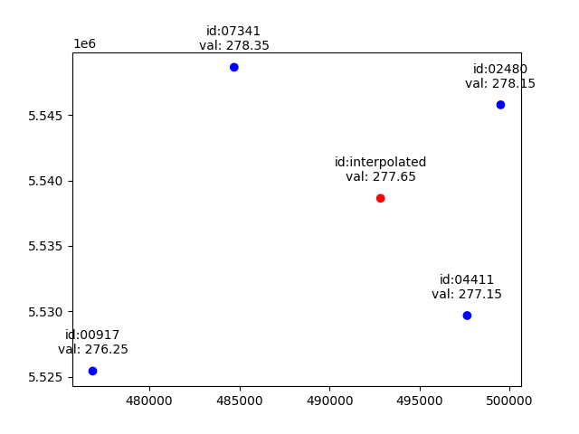
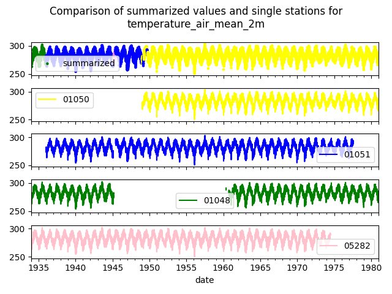

# Python API

## Introduction

The API offers access to different data products. They are outlined in more detail within the 
[data](../data/overview.md) chapter.
Please also check out complete examples about how to use the API in the 
[examples](https://github.com/earthobservations/wetterdienst/tree/main/examples) folder. In order to explore all
features interactively, you might want to try the [cli](cli.md). For managing general settings, please refer to the
[settings](settings.md) chapter.

## Available APIs

The available APIs can be accessed by the top-level API Wetterdienst. This API also
allows the user to discover the available APIs of each service included:

```{code-cell}
---
mystnb:
  number_source_lines: true
---
from wetterdienst import Wetterdienst

coverage = Wetterdienst.discover()
coverage
```

To load any of the available APIs pass the provider and the network of data to the
wetterdienst api factory:

```{code-cell}
---
mystnb:
  number_source_lines: true
---
from wetterdienst import Wetterdienst

Wetterdienst(provider="dwd", network="observation")
```

## Request arguments

A request is typically defined by three arguments:

- ``parameters``
- ``start_date``
- ``end_date``

Parameters can be requested in different ways e.g.

- using a tuple of resolution and dataset

```{code-cell}
---
mystnb:
  number_source_lines: true
---
from wetterdienst.provider.dwd.observation import DwdObservationRequest

DwdObservationRequest(
    parameters=("daily", "climate_summary")  # will resolve to all parameters of kl
)
```

- using a tuple of resolution, dataset, parameter

```{code-cell}
---
mystnb:
  number_source_lines: true
---
from wetterdienst.provider.dwd.observation import DwdObservationRequest

DwdObservationRequest(
    parameters=("daily", "climate_summary", "precipitation_height")
)
```

- the same with the original names

```{code-cell}
---
mystnb:
  number_source_lines: true
---
from wetterdienst.provider.dwd.observation import DwdObservationRequest

DwdObservationRequest(
    parameters=("daily", "kl", "rsk")
)
```

- using the metadata model

```{code-cell}
---
mystnb:
  number_source_lines: true
---
from wetterdienst.provider.dwd.observation import DwdObservationRequest, DwdObservationMetadata
  
DwdObservationRequest(
    parameters=DwdObservationMetadata.daily.kl  # will resolve to all parameters of kl
)
```

- using a list of tuples

```{code-cell}
---
mystnb:
  number_source_lines: true
---
from wetterdienst.provider.dwd.observation import DwdObservationRequest

DwdObservationRequest(
    parameters=[("daily", "climate_summary"), ("daily", "precipitation_more")]
)
```

- using a list of metadata

```{code-cell}
---
mystnb:
  number_source_lines: true
---
from wetterdienst.provider.dwd.observation import DwdObservationRequest, DwdObservationMetadata

DwdObservationRequest(
    parameters=[DwdObservationMetadata.daily.kl, DwdObservationMetadata.daily.more_precip]
)
```

For some weather service one can select which period of the data is request with ``periods``.
Valid periods are ``historical``, ``recent`` and ``now``. ``periods`` can be given as a list or a single value.
The value can be a string, the enumeration value or the enumeration name e.g.

- by using the exact enumeration e.g.

```{code-cell}
---
mystnb:
  number_source_lines: true
---
from wetterdienst.metadata.period import Period

Period.HISTORICAL
```

- by using the enumeration name or value as string e.g.

```python
"historical" or "HISTORICAL"
```
If a weather service has periods, the period argument typically can be used as replacement
for the start_date and end_date arguments. In case both arguments are given they are used
as a filter for the data.

Regarding the definition of requested parameters:

## Data

In case of the DWD, requests can be defined by either of period or
``start_date`` and ``end_date``. Use ``DwdObservationRequest.discover()``
to discover available parameters based on the given filter arguments.

### Stations

#### all stations

Get station information for a given *dataset/parameter* and
*period*.

```{code-cell}
---
mystnb:
  number_source_lines: true
---
import datetime as dt
from wetterdienst.provider.dwd.observation import DwdObservationRequest

request = DwdObservationRequest(
    parameters=("daily", "precipitation_more"),
    start_date=dt.datetime(2020, 1, 1),
    end_date=dt.datetime(2020, 1, 20)
)
stations = request.all()
df = stations.df
df
```

The function returns a Polars DataFrame with information about the available stations.

#### filter by station id

```{code-cell}
---
mystnb:
  number_source_lines: true
---
import datetime as dt
from wetterdienst.provider.dwd.observation import DwdObservationRequest

request = DwdObservationRequest(
    parameters=("daily", "precipitation_more"),
    start_date=dt.datetime(2020, 1, 1),
    end_date=dt.datetime(2020, 1, 20)
)
stations = request.filter_by_station_id(station_id=("01048", ))
df = stations.df
df
```

#### filter by name

```{code-cell}
---
mystnb:
  number_source_lines: true
---
import datetime as dt
from wetterdienst.provider.dwd.observation import DwdObservationRequest

request = DwdObservationRequest(
    parameters=("daily", "precipitation_more"),
    start_date=dt.datetime(2020, 1, 1),
    end_date=dt.datetime(2020, 1, 20)
)
stations = request.filter_by_name(name="Dresden-Klotzsche")
df = stations.df
df
```

#### filter by distance

Distance in kilometers (default)

```{code-cell}
---
mystnb:
  number_source_lines: true
---
import datetime as dt
from wetterdienst.provider.dwd.observation import DwdObservationRequest

hamburg = (53.551086, 9.993682)
request = DwdObservationRequest(
    parameters=("hourly", "temperature_air"),
    start_date=dt.datetime(2020, 1, 1),
    end_date=dt.datetime(2020, 1, 20)
)
stations = request.filter_by_distance(latlon=hamburg, distance=30, unit="km")
df = stations.df
df
```

Distance in miles

```{code-cell}
---
mystnb:
  number_source_lines: true
---
import datetime as dt
from wetterdienst.provider.dwd.observation import DwdObservationRequest

hamburg = (53.551086, 9.993682)
request = DwdObservationRequest(
    parameters=("hourly", "temperature_air"),
    start_date=dt.datetime(2020, 1, 1),
    end_date=dt.datetime(2020, 1, 20)
)
stations = request.filter_by_distance(latlon=hamburg, distance=30, unit="mi")
df = stations.df
df
```

#### filter by rank

```{code-cell}
---
mystnb:
  number_source_lines: true
---
import datetime as dt
from wetterdienst.provider.dwd.observation import DwdObservationRequest

hamburg = (53.551086, 9.993682)
request = DwdObservationRequest(
    parameters=("hourly", "temperature_air"),
    start_date=dt.datetime(2020, 1, 1),
    end_date=dt.datetime(2020, 1, 20)
)
stations = request.filter_by_rank(latlon=hamburg, rank=5)
df = stations.df
df
```

#### filter by bbox

```{code-cell}
---
mystnb:
  number_source_lines: true
---
import datetime as dt
from wetterdienst.provider.dwd.observation import DwdObservationRequest

bbox = (8.9, 50.0, 8.91, 50.01)
request = DwdObservationRequest(
    parameters=("hourly", "temperature_air"),
    start_date=dt.datetime(2020, 1, 1),
    end_date=dt.datetime(2020, 1, 20)
)
stations = request.filter_by_bbox(*bbox)
df = stations.df
df
```

### Values

Values are just an extension of requests. You can query data by using the
`.query()` method on the values object:

```{code-cell}
---
mystnb:
  number_source_lines: true
---
from wetterdienst.provider.dwd.observation import DwdObservationRequest
from wetterdienst import Settings

# if no settings are provided, default settings are used which are
# Settings(ts_shape="long", ts_humanize=True, ts_si_units=True)
request = DwdObservationRequest(
    parameters=[("daily", "kl"), ("daily", "solar")],
    start_date="1990-01-01",
    end_date="2020-01-01",
)
stations = request.filter_by_station_id(station_id=("00003", "01048"))

# From here you can query data by station
for result in stations.values.query():
    # analyse the station here
    break

df = result.df.drop_nulls()
df
```

Or you can query all data at once:

```{code-cell}
---
mystnb:
  number_source_lines: true
---
from wetterdienst.provider.dwd.observation import DwdObservationRequest
from wetterdienst import Settings

# if no settings are provided, default settings are used which are
# Settings(ts_shape="long", ts_humanize=True, ts_si_units=True)
request = DwdObservationRequest(
    parameters=[("daily", "kl"), ("daily", "solar")],
    start_date="1990-01-01",
    end_date="2020-01-01",
)
stations = request.filter_by_station_id(station_id=("00003", "01048"))
df = stations.values.all().df.drop_nulls()
df
```

This gives us the most options to work with the data, getting multiple parameters at
once, parsed nicely into column structure with improved parameter names. Instead of
``start_date`` and ``end_date`` you may as well want to use ``period`` to update your
database once in a while with a fixed set of records.

In case you use `filter_by_rank` you may want to skip empty stations. We can use the Settings from 
[settings](settings.md) to achieve that:

```{code-cell}
---
mystnb:
  number_source_lines: true
---
from wetterdienst import Settings
from wetterdienst.provider.dwd.observation import DwdObservationRequest

settings = Settings(ts_skip_empty=True, ts_skip_criteria="min", ts_skip_threshold=0.2)
karlsruhe = (49.19780976647141, 8.135207205143768)
request = DwdObservationRequest(
  parameters=[("daily", "kl")],
  start_date="2021-01-01",
  end_date="2021-12-31",
  settings=settings,
)
stations = request.filter_by_rank(latlon=karlsruhe, rank=2)
values = stations.values.all()
print(values.df.head())
# df_stations has only stations that appear in the values
values.df_stations
```

### Interpolation

Occasionally, you may require data specific to your precise location rather than relying on values measured at a
station's location. To address this need, we have introduced an interpolation feature, enabling you to interpolate data
from nearby stations to your exact coordinates. The function leverages the four closest stations to your specified
latitude and longitude and employs the bilinear interpolation method provided by the scipy package (interp2d) to
interpolate the given parameter values. Currently, this interpolation feature is exclusive to the parameters 
- ``temperature_air_mean_2m``
- ``temperature_air_max_2m``
- ``temperature_air_min_2m``
- ``humidity``
- ``wind_speed``
- ``precipitation_height``.

There are several settings that can be used to control the interpolation behavior:

| Name                                  | Type             | Default                                      | Description                                                                                                                                                                                                             |
|---------------------------------------|------------------|----------------------------------------------|-------------------------------------------------------------------------------------------------------------------------------------------------------------------------------------------------------------------------|
| ts_interp_station_distance            | dict[str, float] | 20.0 (precipitation_height)<br/>40.0 (other) | Max distance for stations used for interpolation (in km)                                                                                                                                                                |
| ts_interp_use_nearby_station_distance | float            | 1.0                                          | Distance (in km) until which the value of a nearby station is used instead of interpolation.                                                                                                                            |
| ts_interp_min_gain_of_value_pairs     | float            | 0.1                                          | Minimum gain of value pairs [for an additional station] to be included in the list of stations used. This is to prevent taking all stations into account in case of a dense station network.                            |
| ts_interp_num_additional_stations     | int              | 3                                            | Number of additional stations to be used for interpolation regardless of min_gain_of_value_pairs. This is to ensure that at least a certain number of stations are used for interpolation, even if the gain is not met. |

The graphic below shows values of the parameter ``temperature_air_mean_2m`` from multiple stations measured at the same time.
The blue points represent the position of a station and includes the measured value.
The red point represents the position of the interpolation and includes the interpolated value.



Values represented as a table:

| station_id | resolution | dataset         | parameter               | date                      | value  |
|------------|------------|-----------------|-------------------------|---------------------------|--------|
| 02480      | daily      | climate_summary | temperature_air_mean_2m | 2022-01-02 00:00:00+00:00 | 278.15 |
| 04411      | daily      | climate_summary | temperature_air_mean_2m | 2022-01-02 00:00:00+00:00 | 277.15 |
| 07341      | daily      | climate_summary | temperature_air_mean_2m | 2022-01-02 00:00:00+00:00 | 278.35 |
| 00917      | daily      | climate_summary | temperature_air_mean_2m | 2022-01-02 00:00:00+00:00 | 276.25 |

The interpolated value looks like this:

| resolution | dataset         | parameter               | date                      | value  |
|------------|-----------------|-------------------------|---------------------------|--------|
| daily      | climate_summary | temperature_air_mean_2m | 2022-01-02 00:00:00+00:00 | 277.65 |

```{code-cell}
---
mystnb:
  number_source_lines: true
---
import datetime as dt
from wetterdienst.provider.dwd.observation import DwdObservationRequest

request = DwdObservationRequest(
    parameters=("hourly", "temperature_air", "temperature_air_mean_2m"),
    start_date=dt.datetime(2022, 1, 1),
    end_date=dt.datetime(2022, 1, 20),
)
values = request.interpolate(latlon=(50.0, 8.9))
df = values.df
df
```

Instead of a latlon you may alternatively use an existing station id for which to interpolate values in a manner of
getting a more complete dataset:

```{code-cell}
---
mystnb:
  number_source_lines: true
---
import datetime as dt
from wetterdienst.provider.dwd.observation import DwdObservationRequest

request = DwdObservationRequest(
    parameters=("hourly", "temperature_air", "temperature_air_mean_2m"),
    start_date=dt.datetime(2022, 1, 1),
    end_date=dt.datetime(2022, 1, 20),
)
values = request.interpolate_by_station_id(station_id="02480")
df = values.df
df
```

Increase maximum distance for interpolation:

```{code-cell}
---
mystnb:
  number_source_lines: true
---
import datetime as dt
from wetterdienst.provider.dwd.observation import DwdObservationRequest
from wetterdienst import Settings

settings = Settings(ts_interpolation_station_distance={"precipitation_height": 25.0})
request = DwdObservationRequest(
    parameters=("hourly", "precipitation", "precipitation_height"),
    start_date=dt.datetime(2022, 1, 1),
    end_date=dt.datetime(2022, 1, 20),
    settings=settings
)
values = request.interpolate(latlon=(52.8, 12.9))
df = values.df
df
```

Interpolation is still in its early stages, we welcome feedback to enhance and refine its functionality. 

### Summary

Similar to interpolation you may sometimes want to combine multiple stations to get a complete list of data. For that
reason you can use `.summary(latlon)`, which goes through nearest stations and combines data from them meaningful. The
following figure visualizes how summary works. The first graph shows the summarized values of the parameter
``temperature_air_mean_2m`` from multiple stations.



The code to execute the summary is given below. It currently only works for ``DwdObservationRequest`` and individual parameters.
Currently, the following parameters are supported (more will be added if useful): ``temperature_air_mean_2m``, ``wind_speed``, ``precipitation_height``.

```{code-cell}
---
mystnb:
  number_source_lines: true
---
import datetime as dt
from wetterdienst.provider.dwd.observation import DwdObservationRequest

request = DwdObservationRequest(
    parameters=("hourly", "temperature_air", "temperature_air_mean_2m"),
    start_date=dt.datetime(2022, 1, 1),
    end_date=dt.datetime(2022, 1, 20),
)
values = request.summarize(latlon=(50.0, 8.9))
df = values.df
df
```

Instead of a latlon you may alternatively use an existing station id for which to summarize values in a manner of
getting a more complete dataset:

```{code-cell}
---
mystnb:
  number_source_lines: true
---
import datetime as dt
from wetterdienst.provider.dwd.observation import DwdObservationRequest

request = DwdObservationRequest(
    parameters=("hourly", "temperature_air", "temperature_air_mean_2m"),
    start_date=dt.datetime(2022, 1, 1),
    end_date=dt.datetime(2022, 1, 20),
)
values = request.summarize_by_station_id(station_id="02480")
df = values.df
df
```

Summary is still in its early stages, we welcome feedback to enhance and refine its functionality.

### Format

#### To Dict

```{code-cell}
---
mystnb:
  number_source_lines: true
---
from wetterdienst.provider.dwd.observation import DwdObservationRequest

request = DwdObservationRequest(
    parameters=("daily", "kl", "temperature_air_mean_2m"),
    start_date="2020-01-01",
    end_date="2020-01-02"
)
stations = request.filter_by_station_id(station_id="01048")
values = stations.values.all()
values.to_dict(with_metadata=True, with_stations=True)
```

#### To Json

```{code-cell}
---
mystnb:
  number_source_lines: true
---
from wetterdienst.provider.dwd.observation import DwdObservationRequest

request = DwdObservationRequest(
    parameters=("daily", "kl", "temperature_air_mean_2m"),
    start_date="2020-01-01",
    end_date="2020-01-02"
)
stations = request.filter_by_station_id(station_id="01048")
values = stations.values.all()
print(values.to_json(with_metadata=True, with_stations=True))
```

#### To Ogc Feature Collection

```{code-cell}
---
mystnb:
  number_source_lines: true
---
from wetterdienst.provider.dwd.observation import DwdObservationRequest

request = DwdObservationRequest(
    parameters=("daily", "kl", "temperature_air_mean_2m"),
    start_date="2020-01-01",
    end_date="2020-01-02"
)
stations = request.filter_by_station_id(station_id="01048")
values = stations.values.all()
values.to_ogc_feature_collection(with_metadata=True)
```

#### To GeoJson

```{code-cell}
---
mystnb:
  number_source_lines: true
---
from wetterdienst.provider.dwd.observation import DwdObservationRequest

request = DwdObservationRequest(
    parameters=("daily", "kl", "temperature_air_mean_2m"),
    start_date="2020-01-01",
    end_date="2020-01-02"
)
stations = request.filter_by_station_id(station_id="01048")
values = stations.values.all()
print(values.to_geojson(with_metadata=True))
```

#### To CSV

```{code-cell}
---
mystnb:
  number_source_lines: true
---
from wetterdienst.provider.dwd.observation import DwdObservationRequest

request = DwdObservationRequest(
    parameters=("daily", "kl", "temperature_air_mean_2m"),
    start_date="2020-01-01",
    end_date="2020-01-02"
)
stations = request.filter_by_station_id(station_id="01048")
values = stations.values.all()
print(values.to_csv())
```

### SQL

Querying data using SQL is provided by an in-memory DuckDB_ database.
In order to explore what is possible, please have a look at the 
[DuckDB SQL introduction](https://duckdb.org/docs/sql/introduction).

The result data is provided through a virtual table called ``data``.

```{code-cell}
---
mystnb:
  number_source_lines: true
---
from wetterdienst import Settings
from wetterdienst.provider.dwd.observation import DwdObservationRequest

settings = Settings(ts_shape="long", ts_humanize=True, ts_convert_units=True)  # defaults
request = DwdObservationRequest(
  parameters=("hourly", "temperature_air", "temperature_air_mean_2m"),
  start_date="2019-01-01",
  end_date="2020-01-01",
  settings=settings
)
stations = request.filter_by_station_id(station_id=[1048])
values = stations.values.all()
df = values.filter_by_sql("parameter='temperature_air_mean_2m' AND value < -7.0;")
df
```

### Export

Data can be exported to [SQLite](https://www.sqlite.org/), [DuckDB](https://duckdb.org/docs/sql/introduction), 
[InfluxDB](https://github.com/influxdata/influxdb), [CrateDB](https://github.com/crate/crate) and more targets.
A target is identified by a connection string.

Examples:

- sqlite:///dwd.sqlite?table=weather
- duckdb:///dwd.duckdb?table=weather
- influxdb://localhost/?database=dwd&table=weather
- crate://localhost/?database=dwd&table=weather
# parquet, feather, zarr
- file:///path/to/dwd.parquet
- file:///path/to/dwd.feather
- file:///path/to/dwd.zarr

```python
from wetterdienst import Settings
from wetterdienst.provider.dwd.observation import DwdObservationRequest

request = DwdObservationRequest(
  parameters=("hourly", "temperature_air"),
  start_date="2019-01-01",
  end_date="2020-01-01",
)
stations = request.filter_by_station_id(station_id=[1048, 1050])
stations.values.to_target("influxdb://localhost/?database=dwd&table=weather")
```

The previous example uses a batch approach meaning each station is written one by one. Also, it will automatically 
append data after the first batch. 

You could also first collect all data and then write it at once:

```python
from wetterdienst import Settings
from wetterdienst.provider.dwd.observation import DwdObservationRequest

request = DwdObservationRequest(
  parameters=("hourly", "temperature_air"),
  start_date="2019-01-01",
  end_date="2020-01-01",
)
stations = request.filter_by_station_id(station_id=[1048, 1050])
stations.values.all().to_target("influxdb://localhost/?database=dwd&table=weather", if_exists="append")
```

You could also iterate over the stations and write them one by one:

```python
from wetterdienst import Settings
from wetterdienst.provider.dwd.observation import DwdObservationRequest

request = DwdObservationRequest(
  parameters=("hourly", "temperature_air"),
  start_date="2019-01-01",
  end_date="2020-01-01",
)
stations = request.filter_by_station_id(station_id=[1048, 1050])
for station in stations.values.query():
    station.to_target("influxdb://localhost/?database=dwd&table=weather", if_exists="append")
```

The argument `if_exists` supports the following modes:
- `fail`: Raise an error if the table/file already exists.
- `replace`: Drop the table/file before inserting new values.
- `append`: Insert new values to the existing table (not supported by files).
- `skip`: Do nothing if the table/file already exists.

### Caching

The backbone of wetterdienst uses fsspec caching. It requires to create a directory under ``/home`` for the
most cases. If you are not allowed to write into ``/home`` you will run into ``OSError``. For this purpose you can set
an environment variable ``WD_CACHE_DIR`` to define the place where the caching directory should be created.

To find out where your cache is located you can use the following code:

```{code-cell}
---
mystnb:
  number_source_lines: true
---
from wetterdienst import Settings

settings = Settings()
settings.cache_dir
```

Or similarly with the cli:

```{code-cell} bash

!wetterdienst cache
```

### FSSPEC

FSSPEC is used for flexible file caching. It relies on the two libraries requests and aiohttp. Aiohttp is used for
asynchronous requests and may swallow some errors related to proxies, ssl or similar. Use the defined variable
FSSPEC_CLIENT_KWARGS to pass your very own client kwargs to fsspec e.g.

```{code-cell}
---
mystnb:
  number_source_lines: true
---
from wetterdienst import Settings
from wetterdienst.provider.dwd.observation import DwdObservationRequest

settings = Settings(fsspec_client_kwargs={"trust_env": True})  # use proxy from environment variables

request = DwdObservationRequest(
    parameters=("hourly", "temperature_air"),
    settings=settings
)
stations = request.filter_by_station_id(station_id=[1048])
stations
```